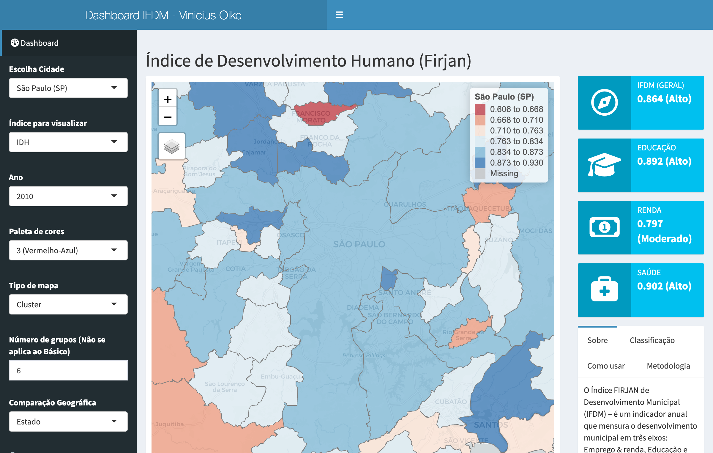

# Dashboard IFDM

Este painel mostra o desenvolvimento dos 5.570 municípios brasileiros pelo
**Índice FIRJAN de Desenvolvimento Municipal (IFDM)**. O IFDM mede o
desenvolvimento em três eixos — Educação, Saúde e Emprego & Renda — a partir de
dados públicos oficiais, com leitura análoga à do IDH da ONU. Diferentemente do
IDH, o IFDM sai todo ano.

A série cobre 2013 a 2023 (IFDM 2025, ano-base 2023, metodologia revisada). O
painel traz um mapa coroplético interativo, a comparação do município escolhido
com seu estado, região ou o Brasil, e a evolução de cada indicador no tempo.

[**→ Abrir o dashboard**](https://viniciusoike-shiny-firjan-ifdm.share.connect.posit.cloud)

---

An interactive dashboard for Brazil's FIRJAN Municipal Development Index (IFDM)
— choropleth map, city-vs-state benchmarks, and annual time series for all
5,570 Brazilian municipalities. Built with R Shiny. App is in Portuguese.

## Features

- **Choropleth map** — filter by year (2013–2023) and any of the four IFDM
  dimensions (Overall, Education, Health, Employment & Income).
- **Autocomplete search** — find any municipality, ordered by population.
- **Benchmarks** — ranking, score distribution, and comparison against the
  selected state, region, or national average.
- **Time series** — annual evolution of each indicator for the selected city.
- **Data download** — export the full municipal dataset as CSV or XLSX.
- **About section** — methodology notes, the IFDM reading scale, and contact
  information.

## Built with

R Shiny and [bslib](https://rstudio.github.io/bslib/), themed with the EKIO
brand (`_brand.yaml` + `styles.css`); interactive maps via
[tmap](https://r-tmap.github.io/tmap/) v4 and time series via
[echarts4r](https://echarts4r.john-coene.com/). Dependencies are pinned with
[renv](https://rstudio.github.io/renv/).

## Data

The FIRJAN source workbooks (from the
[IFDM downloads page](https://www.firjan.com.br/ifdm/downloads/)) live in
`data-raw/`; the scripts there build the processed datasets in `data/`.
